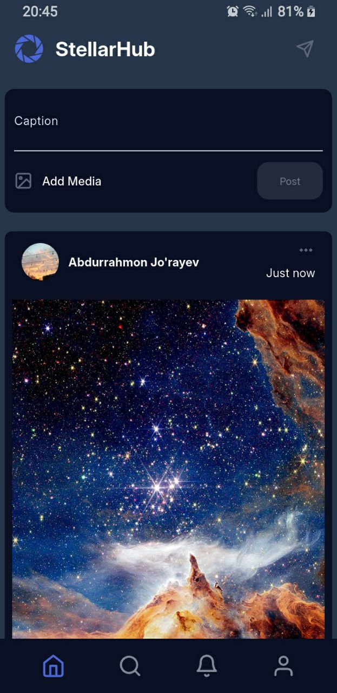
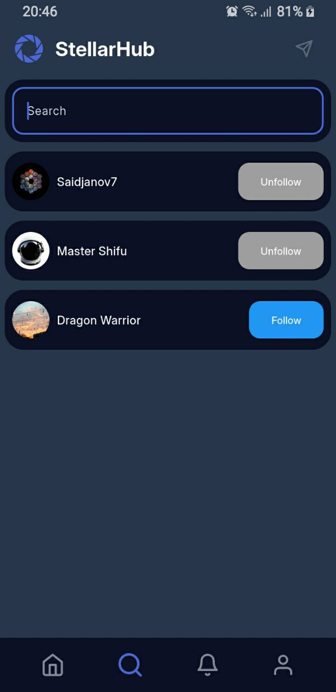
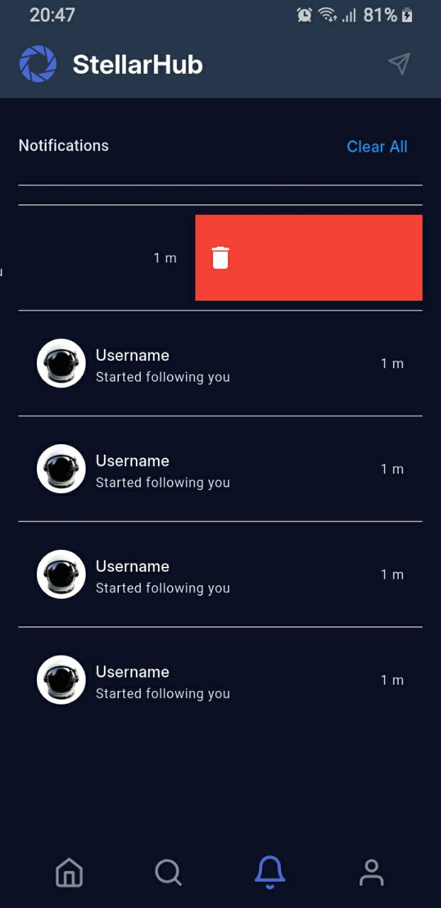
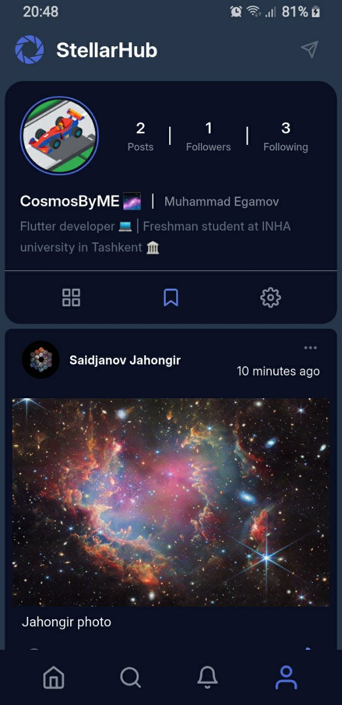
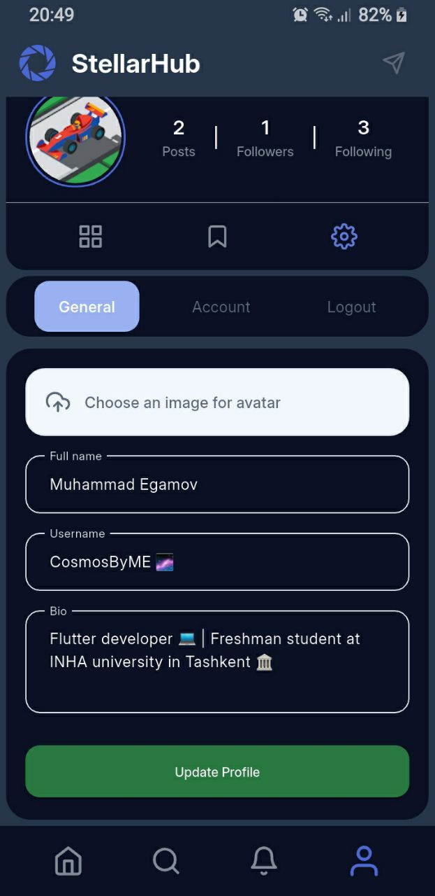
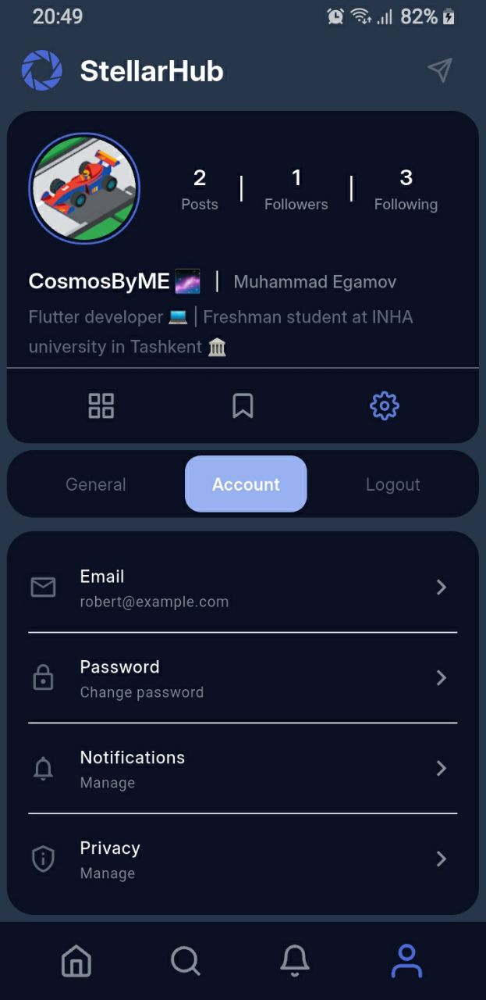
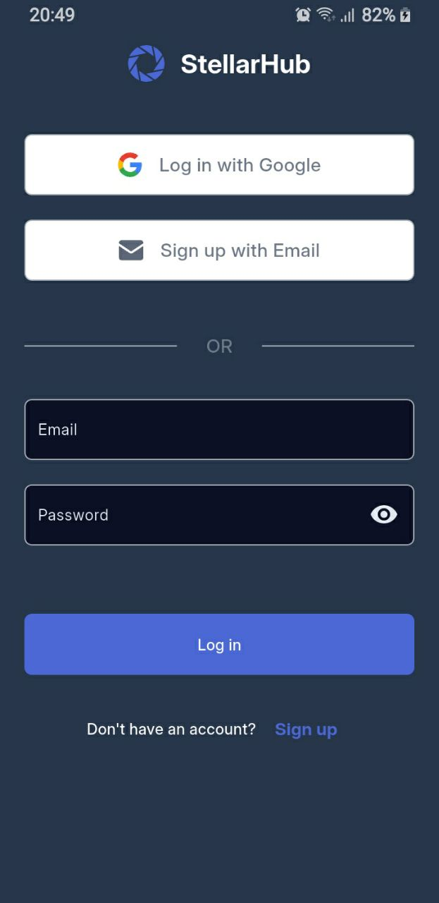
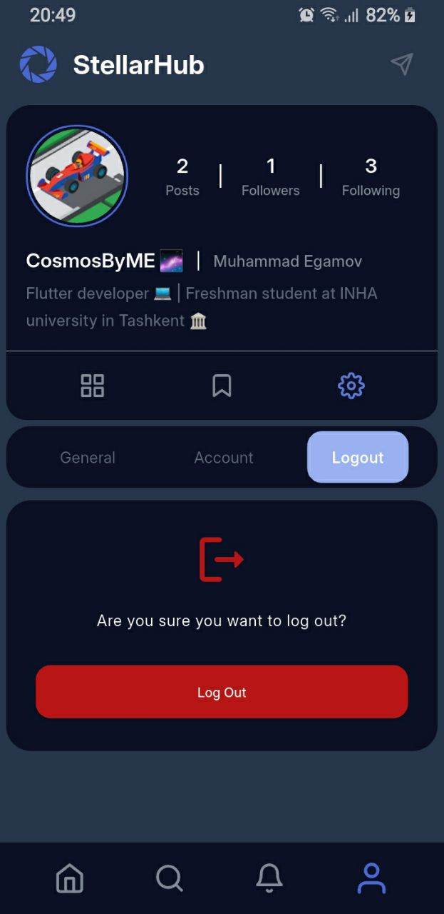

<div align="center">
  

  # Space App

  *A beautiful, modern, and feature-rich Flutter application for social feeds and posts.*

  <p align="center">
    
    
    
    
    
  </p>
</div>

---

## 📸 Screenshots

<div align="center">
  
  &nbsp;
  
  &nbsp;
  
</div>
<br>
<div align="center">
  
  &nbsp;
  
  &nbsp;
  
</div>
<br>
<div align="center">
  
  &nbsp;
  
</div>

## 🚀 Features

- **Social Feed**: Scroll through posts seamlessly in a dynamic feed.
- **User Authentication**: Secure email login, sign-up, and **Google Sign-In** powered by Firebase Auth.
- **Following System**: Follow and unfollow users, building your customized feed.
- **Engagement**: Like, comment on, and save posts to your personal collections.
- **Profile Interface**: View your profile, followers, bookmarks, and managed posts intuitively.
- **State Management**: Robust architecture utilizing the BLoC pattern.
- **Cloud Database**: Real-time cloud synchronization and storage via Cloud Firestore and Supabase.
- **Polished UI/UX**: Smooth loading states using `skeletonizer` and customized standard components.

## 🛠️ Tech Stack & Libraries

- **Framework**: [Flutter](https://flutter.dev/) SDK `^3.10.8`
- **State Management**: `flutter_bloc`
- **Backend & Database**: `firebase_core`, `firebase_auth`, `cloud_firestore`, `supabase_flutter`
- **Authentication**: `google_sign_in`
- **UI Components**: `cupertino_icons`, `skeletonizer`, `cached_network_image`, `flutter_svg`
- **Local Storage**: `shared_preferences`
- **Environment config**: `flutter_dotenv`

## 👨‍💻 About the Author

<div align="center">
    


  **Built with ❤️ by CosmosByME.**
</div>

## ⚙️ Getting Started

### Prerequisites

- [Flutter SDK](https://docs.flutter.dev/get-started/install) (v3.10.8 or higher recommended)
- [Dart SDK](https://dart.dev/get-dart)
- An emulator or physical device for testing
- A Firebase Project and a Supabase Project.

### Installation & Setup

1. **Clone the repository**:
   ```bash
   git clone <repository-url>
   cd space_app
   ```

2. **Install Dependencies**:
   ```bash
   flutter pub get
   ```

3. **Configure Environment**:
   Create a `.env` file in the root directory:
   ```bash
   SUPABASE_URL=YOUR_SUPABASE_URL
   SUPABASE_SERVICE_KEY=YOUR_SUPABASE_ANON_KEY
   ```

4. **Firebase Setup**:
   - Run `flutterfire configure` to generate `firebase_options.dart`.
   - Download and place `google-services.json` in `android/app/`.
   - Download and place `GoogleService-Info.plist` in `ios/Runner/`.

5. **Google Sign-In Configuration**:

   #### 🤖 Android Setup
   To enable Google Sign-In, you must add your SHA fingerprints to the Firebase Console:
   - Run this command in your terminal to get the SHA-1 and SHA-256 keys:
     ```powershell
     ./gradlew signingReport
     ```
   - Copy the **SHA-1** and **SHA-256** from the `debug` variant.
   - Go to **Firebase Console** > **Project Settings** > **General**, select your Android app, and add the fingerprints.

   #### 🍎 iOS Setup
   - Open `ios/Runner/Info.plist`.
   - Locate or add the `CFBundleURLTypes` key and add your **REVERSED_CLIENT_ID** (found in `GoogleService-Info.plist`):
     ```xml
     <key>CFBundleURLTypes</key>
     <array>
         <dict>
             <key>CFBundleTypeRole</key>
             <string>Editor</string>
             <key>CFBundleURLSchemes</key>
             <array>
                 <string>com.googleusercontent.apps.YOUR_CLIENT_ID</string>
             </array>
         </dict>
     </array>
     ```

6. **Run the app**:
   ```bash
   flutter run
   ```
